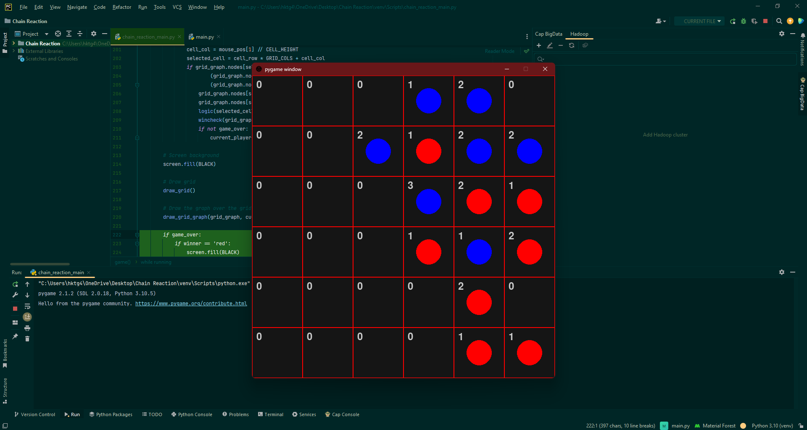

# Chain Reaction Game

A Python implementation of the popular **Chain Reaction** strategy game built using **Pygame**. Players take turns placing atoms in cells, causing chain reactions when cells reach critical mass. The objective is to eliminate all opponent atoms and dominate the board.



---

## 📌 Features

-  Turn-based multiplayer gameplay
-  Real-time chain reaction mechanics
-  Interactive graphical interface using Pygame
-  Automatic explosion and atom propagation
-  Win detection system
-  Lightweight and easy to run

---

##  Tech Stack

- Python
- Pygame

---

##  Gameplay

### Rules

1. Players take turns placing an atom in an empty cell or a cell they already own.
2. Each cell has a critical mass:
   - Corner cells: 2
   - Edge cells: 3
   - Middle cells: 4
3. When a cell reaches its critical mass:
   - It explodes.
   - Atoms are distributed to adjacent cells.
   - Ownership of affected cells changes to the exploding player's color.
4. Chain reactions may trigger multiple explosions.
5. The last player remaining on the board wins.

## Installation

### Clone the repository

```bash
git clone https://github.com/yourusername/chain-reaction-game.git
cd chain-reaction-game
```

### Create a virtual environment (Optional)

```bash
python -m venv venv
```

### Activate virtual environment

Windows:

```bash
venv\Scripts\activate
```

Linux / Mac:

```bash
source venv/bin/activate
```

### Install dependencies

```bash
pip install pygame
```

### Run the game

```bash
python main.py
```

---


## 🧠 Game Logic

The game is based on a grid where each cell maintains:

- Current atom count
- Cell owner
- Critical mass

When a cell reaches critical mass, it explodes and distributes atoms to neighboring cells, potentially triggering further explosions and creating large chain reactions.

---
⭐ If you like this project, consider giving it a star!
